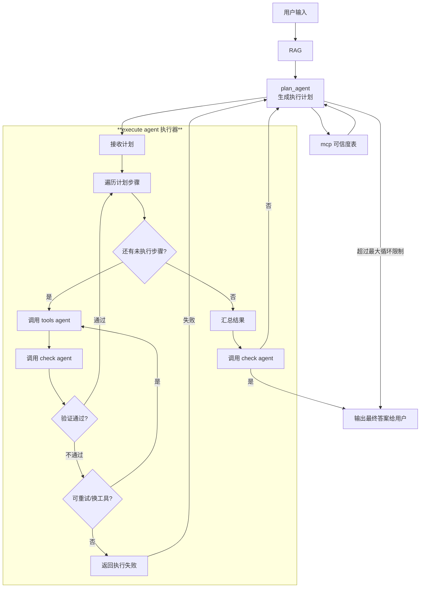

# 责任链（Planner → Executor → Check）开发说明（最新实现）

本文基于 `docs/dev.md` 的工作流与分层规范，给出三类 Agent（planner/executor/check）的责任链实现与流式事件（SSE）输出的落地说明。

## 目标与范围
- 责任链流程遵循 `docs/dev.md` 的智能调度 Agent 核心工作流：


- 兼容现有实现：
  - 规划：`agentlz/services/chain/steps/step1_planner.py`
  - 执行：`agentlz/services/chain/steps/step2_executor.py`
  - 校验：`agentlz/services/chain/steps/step3_check.py`
- 支持异步执行、超时/重试、失败回退与统一日志指标。

## 分层与依赖
- 入口层（`app`）：路由/CLI 触发责任链；不直接依赖具体 Agent 实现。
- 编排层（`agents`）：
  - 定义责任链骨架（上下文、处理器、调度器）。
  - 适配 planner/executor/check 的具体调用逻辑。
- 工具层/服务层（`tools`/`services`）：提供外部工具与业务服务；责任链节点调用它们。
- 基础设施（`core`）：日志、重试、并发、模型工厂、错误类型。

目录规划：
- `agentlz/services/chain/chain_service.py`：入口执行器与上下文（`run_chain`、`ChainContext`、`_is_check_passed`）；流式事件生成器（`stream_chain_generator`）
- `agentlz/app/routers/chain.py`：SSE 路由 `GET /v1/chat?user_input=...`
- `agentlz/schemas/events.py`：事件壳 `EventEnvelope`
- `agentlz/schemas/workflow.py`：工作流模型（`ToolCall`、`ExecutorTrace`）
- `agentlz/services/chain/handler.py`：节点基类原型
- `agentlz/services/chain/steps/`：分步处理器与根节点

## 关键概念与数据结构
- `ChainContext`
  - 字段：`user_input`、`plan`、`fact_msg`、`check_result`、`errors`、`steps`、`tool_calls`，以及：`ai_agent_config_map/execution_history/current_task/max_step/session_id/tenant_id`
  - 作用：贯穿链路的数据容器，记录上下文与中间结果与运行元数据；其中 `steps` 仅保留高层节点轨迹（root/planner/executor/check），`tool_calls` 存放执行器拦截到的每次 MCP 工具调用的结构化日志（name/status/input/output）。
- `Handler`
  - 接口：`can_handle(ctx)`、`handle(ctx)`，均为 `async`。
  - 约定：节点只关注本步骤的职责，其他交由下一个节点。
- `PlannerHandler`
  - 依据可信度表或自我规划生成 `WorkflowPlan`；将 `execution_chain/mcp_config/instructions` 写入 `ctx.plan`。
- `ExecutorHandler`
  - 调用 MCP 工具链执行计划；将“工具调用摘要 + 最终结果”写入 `ctx.fact_msg`；不再把每次工具调用写入 `steps`，而是写入 `ctx.tool_calls`（结构化）。
- `CheckHandler`
  - 复用 `check_agent` 对 `objectMsg/factMsg` 进行结构化校验；按如下方式重构 `fact_msg`：
    - Agent流程：来自 `ctx.steps` 的高层轨迹
    - 执行器MCP流程：来自 `ctx.tool_calls` 的工具调用明细（输入/输出）；为空则标记“无工具调用”
    - 最终执行结果：从执行器返回的摘要文本中提取“最终结果”段
  - 返回类型强制为 `CheckOutput`；不是对象则视为错误。
  - 通过判定使用 `_is_check_passed`，仅依据 `judge=True` 或 `score>=80`。

## 生命周期与数据流
- 输入：入口层收到用户请求，构造 `ChainContext(user_input=...)`。
- 链接：`PlannerHandler → ExecutorHandler → CheckHandler`。
- 失败策略：
  - Planner 失败：记录 `planner_failed`，降级为空计划或直接返回错误。
  - Executor 失败：记录异常与步骤位置；可选择重试或返回失败。
  - Check 失败：返回不通过结果；可选择回到 Planner 修正计划（拓展场景）。

## 超时与重试
- 每节点支持可配置的 `timeout` 与 `retry`：
  - 建议默认：`timeout=60s`、`retry=2`（指数退避）。
  - 对外部网络调用（MCP、LLM）必须设置超时与重试，避免阻塞事件循环。

## 日志与指标
- 统一使用 `agentlz/core/logger.py`：结构化日志，包含 `request_id/tenant_id/agent_id/latency_ms`。
- 在各步骤发送 SSE 时记录事件名日志（`planner/executor/check`），统一发射器 `emit` 中也记录每个事件的 `evt`。
- 执行器通过回调拦截（`BaseCallbackHandler`）记录真实 I/O，作为权威数据源；启用 `response_format=ExecutorTrace` 仅作为兜底结构化返回。
- 指标建议：
  - `planner_calls_total`、`planner_errors_total`、`planner_latency_ms`
  - `executor_steps_total`、`executor_errors_total`、`executor_latency_ms`
  - `check_calls_total`、`check_failures_total`、`check_latency_ms`

## 错误与异常
- 自定义异常统一在 `core/errors.py`，包括：`PlannerError`、`ExecutorError`、`CheckError`、`ChainTimeoutError`。
- 节点捕获异常后写入 `ctx.errors` 并决定是否继续或返回。

## 配置与环境变量
- 参考 `docs/dev.md` 与 `agentlz/config/settings.py`：
  - 模型与工具密钥：`OPENAI_API_KEY` 等
  - 日志等级：`LOG_LEVEL`
  - 速率限制与并发：可通过 `settings` 暴露链路配置（超时/重试/并发阈值）。

## 安全与合规
- 入口层负责校验 `tenant_id` 与授权；将 `tenant_id` 写入 `ChainContext`。
- 责任链节点禁止直接读写敏感密钥；依赖 `settings` 与 `core/model_factory.py`。

## 测试建议
- 单元测试：
  - `PlannerHandler`：模拟返回结构化 `WorkflowPlan`，校验 `ctx.plan`。
  - `ExecutorHandler`：对 `execute_chain` 提供 stub，校验步骤记录与输出拼接。
  - `CheckHandler`：使用本地 LLM stub 或结构化返回模拟，校验通过/失败分支。
- 集成测试：
  - 从入口到 `run_chain(user_input)` 全链路；记录耗时与失败路径。
  - 对无可用 `plan` Agent 的自我规划路径进行验证。

## 执行流程（落地参考）
```python
# services/chain/chain_service.py
async def run_chain(user_input: Any, *, max_steps: int = 15) -> ChainContext:
    # 1) 构造 ChainContext（记录任务、步数等）
    # 2) 通过 RootHandler 启动执行链
    # 3) 循环：当前节点 handle(ctx) -> next(ctx)
    # 4) Planner -> Executor -> Check；Check 通过则结束，否则回到 Planner 重规划
    # 5) 受 max_steps 保护，避免无限循环
    ...

from agentlz.services.chain.chain_service import run_chain
```

节点跳转规则：
- `RootHandler.next` → `PlannerHandler`（文件：`step1_planner.py`）
- `PlannerHandler.next` → `ExecutorHandler`（文件：`step2_executor.py`）
- `ExecutorHandler.next` → `CheckHandler`（文件：`step3_check.py`）
- `CheckHandler.next` → 通过则 `None`，未通过则重置 `ctx.plan` 并回到 `PlannerHandler`

## 结构化模型（执行器）
- `ToolCall`（`agentlz/schemas/workflow.py`）：`name/status/input/output/server`
- `ExecutorTrace`（`agentlz/schemas/workflow.py`）：`calls: List[ToolCall]`、`actual_chain: List[str]`、`final_result: str`
  - 执行器创建代理时声明 `response_format=ExecutorTrace`，在无回调日志时解析结构化响应作为兜底。

## 流式事件（SSE）
- 路由：`GET /v1/chat?user_input=...`（`agentlz/app/routers/chain.py:10-15`）
- 生成器：`stream_chain_generator`（`agentlz/services/chain/chain_service.py:99-123,176-188`），按节点推进：
  - `chain.step`：阶段名（`planner/executor/check`），来自各步骤显式发送
  - `planner.plan`：`WorkflowPlan`，来自 `ctx.plan`
  - `call.start`：工具调用开始事件，来自执行器工具回调
  - `call.end`：工具调用结束事件，状态统一为 `success`
  - `executor.summary`：执行器完成后推送的摘要文本（`ctx.fact_msg`）
  - `executor.error`：执行器错误事件，载荷包含 `{ stage, message }`
  - `check.summary`：`CheckOutput`，来自 `ctx.check_result`
  - `final`：最终文本，来自 `ctx.fact_msg`
- 帧格式：每帧三行（`event/id/data`）+ 空行，`data` 为 `EventEnvelope` JSON（`agentlz/schemas/events.py:4-10`）

### 前端消费参考
```javascript
const es = new EventSource('/v1/chat?user_input=你的输入');
es.addEventListener('chain.step', e => {
  const env = JSON.parse(e.data);
  setActiveStep(env.payload);
});
es.addEventListener('planner.plan', e => {
  const env = JSON.parse(e.data);
  renderPlan(env.payload);
});
es.addEventListener('call.end', e => {
  const env = JSON.parse(e.data);
  appendToolCard(env.payload);
});

es.addEventListener('call.start', e => {
  const env = JSON.parse(e.data);
  appendToolCard(env.payload);
});
es.addEventListener('executor.summary', e => {
  const env = JSON.parse(e.data);
  renderExecutorSummary(env.payload);
});
es.addEventListener('executor.error', e => {
  const env = JSON.parse(e.data);
  renderExecutorError(env.payload);
});
es.addEventListener('check.summary', e => {
  const env = JSON.parse(e.data);
  renderCheck(env.payload);
});
es.addEventListener('final', e => {
  const env = JSON.parse(e.data);
  setResult(env.payload);
  es.close();
});
```

## 接入入口层
- CLI：在 `agentlz/app/cli.py` 增加命令 `chain-run`，从命令行触发责任链并打印结果与指标。
- HTTP：在 `agentlz/app/http_langserve.py` 增加路由 `POST /v1/chain/run`，请求体包含 `tenant_id` 与 `input`，响应为统一 `AgentResponse`（含 `intermediate_steps`）。

## 后续实现清单
- 新建 `agentlz/agents/chain/` 目录与 `chain.py`/`handlers.py`，按本文接口实现。
- 将现有 `planner_agent`、`executor_agnet`、`check_agent_1` 接入节点。
- 增加日志与指标统计；补充单元/集成测试。
- 在 `docs/` 补充路由与 CLI 使用说明。
