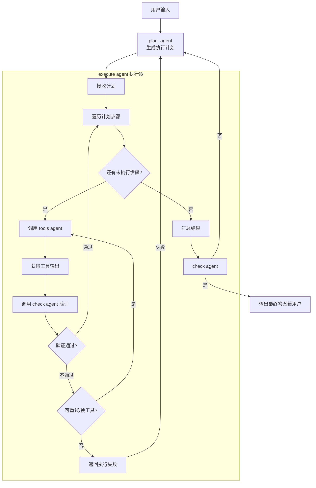

# Agentlz 开发规范

## 开发规范（企业后端 / LangChain）

本规范面向企业级后端服务，目标是提供一个通过 HTTPS 暴露接口的 Agent 平台。企业可在平台上开发/托管 Agent，上传企业文档并进行检索增强（RAG），基础存储采用 SQLite（结构化/元数据）与 Chroma（向量存储）。本规范约束架构分层、编码方式、安全与合规、API 设计、测试与运维等方面，确保可维护、可扩展与可审计。

## 当前目标

1. **Agent 即服务 (Agent as a Service)**: 企业用户可以在本平台开发 `check`, `plan`, `tools` 类型的 Agent。这些 Agent 都通过 MCP (Multi-Agent Communication Protocol) 协议开放接口，可以被其他 Agent 远程调用，实现类似插件的模式。

2. **智能调度 Agent (Intelligent Schedule Agent)**: 开发一个总调度 Agent (`schedule_agent`)，它作为整个系统的“智能指挥官”。这个 Agent 开放 FastAPI 接口，其核心逻辑由一个强大的 LLM 和一个精心设计的“主提示词 (Master Prompt)”驱动，而非固定的代码流程。

### 智能调度 Agent 的核心工作流



`execute_agent` 的工作流程被设计成一个高度灵活、由模型驱动的“思考-行动”循环：

1. **接收用户输入**: `execute_agent` 接收到用户的原始请求。

2. **动态规划 (Planning)**:
    - **首选 `plan` Agent**: `execute_agent` 会首先调用一个名为 `call_plan_agent` 的内部工具。该工具会根据 `agent_tables` 中的可信度表，选择并执行最高可信度的 `plan` Agent (MCP)。`plan` Agent 的职责是进行头脑风暴，将用户模糊的需求分解成一个清晰、可执行的步骤序列（即 Plan）。
    - **自我规划 (Self-Planning)**: 如果 `plan` Agent 的可信度表为空（即没有可用的 `plan` Agent），`call_plan_agent` 工具会无缝切换到“自我规划”模式。在此模式下，`execute_agent` 会利用自身的 LLM 和一个内置的规划提示词，自主生成执行计划。这个过程对上层逻辑是透明的。

3. **执行与验证循环 (Execution-Validation Loop)**:
    - `execute_agent` 会遵循生成的计划，逐一执行每个步骤。
    - **调用工具 (`tools` Agent)**: 对于需要使用工具的步骤，`execute_agent` 会调用 `call_tool_agent` 工具，该工具负责执行指定的 `tools` Agent (MCP)。
    - **立即验证 (`check` Agent)**: 每个 `tools` Agent 执行完毕后，`execute_agent` 会**立即**调用 `call_check_agent` 工具，对前一步的输出结果进行验证。`check` Agent 负责判断结果是否符合预期、是否准确、是否满足任务要求。
    - **智能错误处理**:
        - 如果 `check` Agent 返回失败或不满意的结果，`execute_agent` 的 LLM 会被触发进行“反思”。它会分析失败的原因，并自主决定下一步行动：是使用不同的参数重试当前工具，还是选择一个备用的 `tools` Agent，甚至是重新调用 `plan` Agent 来修正整个计划。
        - 如果 `check` Agent 的可信度表为空，`call_check_agent` 工具会默认返回“成功”，但 `execute_agent` 的主提示词会指导它在这种情况下，需要自行评估工具输出的合理性。

4. **最终验证与汇总**:
    - 当所有计划步骤都成功执行后, `execute_agent` 会对所有步骤的执行结果进行一次最终的汇总。
    - **最终检验 (`check` Agent)**: 汇总结果会被提交给 `call_check_agent` 工具进行最终的全局验证，以确保整个任务的最终结果是完整、连贯且符合用户最高预期的。
    - **失败则重规划**: 如果最终的 `check` Agent 返回失败，`execute_agent` 将返回到**动态规划**阶段，重新生成或修正计划。

5. **生成响应**:
    - 只有当最终验证通过后，`execute_agent` 才会生成最终的、条理清晰的答案，并通过 `ScheduleResponse` 结构返回给用户。该响应结构会包含详细的中间步骤（`intermediate_steps`），以 `AgentStep` 的形式记录了每一次思考和工具调用的过程，提供了极高的透明度。

6. **规范化**:
    - 每一个函数都需要有中文注释，清晰说明其作用、参数、返回值和可能引发的异常。
    - 所有 Agent 或 MCP 的提示词都必须存放在 `agentlz/prompts/` 目录下，并使用中文编写。

### 适用范围

- 仅后端服务；前端不在本仓库内。
- 对外暴露 HTTPS 接口（REST/WS）；内部使用 LangChain/LangGraph 编排。
- 文档上传、切分、嵌入与检索；使用 SQLite + Chroma。
- 面向企业多租户场景，强化鉴权、RBAC、审计与合规。

---

## 目录结构

- `agentlz/app/`：应用入口层（CLI、HTTP 服务、批处理脚本）。
  - `cli.py`：命令行入口，通过 `typer` 暴露命令如 `query`。
  - `http_langserve.py`：HTTP API 入口（基于 LangServe/FastAPI），暴露 `/v1/*` 接口。
  - `mail.py`、`mcp_mail_server.py`、`multi.py`：示例或扩展入口。
- `agentlz/agents/`：Agent 编排层（不同场景的 Agent 构建与协作）。
  - `planner_agent.py`、`multi_agent.py`、`markdown_agent.py` 等。
- `agentlz/tools/`：工具封装层（`@tool` 工具与适配器）。
  - 如 `weather.py`、`search.py`、`markdown.py`。
- `agentlz/workflows/` 或 `agentlz/graphs/`：流程编排/有向图（LangGraph 状态与节点）。
- `agentlz/memory/`：记忆与存储（会话记忆、向量库、检查点）。
- `agentlz/prompts/`：提示词与模板（系统提示、格式指令、少样本示例）。
- `agentlz/schemas/`：数据与响应结构（`pydantic`/`dataclass` 模型）。
  - `responses.py`：统一响应结构与错误模型。
- `agentlz/services/`：业务服务层（领域逻辑，尽量不直接依赖 LLM）。
- `agentlz/integrations/`：外部系统集成（三方 API 客户端封装）。
- `agentlz/core/`：基础设施与通用能力（日志、错误、重试、并发、模型工厂）。
  - `logger.py`、`model_factory.py` 等。
- `agentlz/config/`：配置管理（统一读取 `.env`，集中验证与默认值）。
  - `settings.py`：集中配置入口。
- `agent_tables/*.py`：定义可信度表, 每一个文件对应一个可信度表,里面存储所有可用的 agent(macp)的配置, 每个 agent 有一个可信度(1-100), 可信度越高, 就越可能被调用.
- `tests/`：测试（单元与集成，按包名对齐）。
- `scripts/`：开发运维脚本（lint、test、format、publish）。
- `docs/`：文档（架构说明、接口约定、运行与运维指南）。
- `deploy/`：交付与部署（CI、Docker、K8s/Helm 模板）。
- `examples/`：示例（最小可运行示例与沙盒数据）。
- `.env.example`：环境变量样例（不提交真实密钥）。

注：当前仓库已包含部分目录与文件，不存在的目录按上述规范增补时需保持分层与依赖约束。

---

## 分层与依赖约束

- 入口层（`app`）依赖编排层（`agents`），不可反向依赖。
- 编排层依赖工具/服务/基础设施层（`tools`、`services`、`core`、`config`）。
- 工具层与服务层可依赖 `integrations` 与 `core`，不可依赖 `app` 或上层 `agents`。
- `prompts`、`schemas` 为横切关注点，仅提供数据与模板，不引入业务耦合。
- 严禁循环依赖；保持模块边界清晰、单向。

---

## 编码与命名规范

- 语言与版本：Python = 3.14，必须使用类型标注（type hints）。
- 风格与格式：统一使用 `black`（格式化）、`ruff`（lint）、`isort`（导入排序）。
- 模块命名：职责清晰（`*_agent.py`、`*_tool.py`、`*_graph.py`、`*_service.py`）。
- 文档与注释：采用 Google/NumPy 风格 Docstring；公开函数与类必须有 Docstring。
- 异常：不在业务层抛裸异常；自定义异常置于 `core/errors.py`，外层统一映射为 HTTP 状态码。
- 日志：使用 `core/logger.py` 提供的统一入口；结构化日志（JSON），必含 `request_id`/`tenant_id`。
- 并发：优先使用 `async`/`await`；避免在事件循环中执行阻塞 IO；对外部调用设置超时与重试。
- I/O：所有网络与文件操作必须有超时、重试与失败处理；确保资源释放（`async with`/context manager）。
- 依赖与第三方：通过 `integrations/*_client.py` 封装；默认开启重试、限流与断路器策略。

---

## 安全与合规

- 传输安全：仅开放 HTTPS；推荐在反向代理（Nginx/Envoy）终止 TLS，或 `uvicorn --ssl-certfile/--ssl-keyfile`。
- 身份与授权：默认 `JWT` 鉴权；支持企业级 RBAC（角色/权限/租户）；所有接口需校验 `tenant_id`。
- 多租户：通过 `X-Tenant-ID` 头或 Token 声明租户；严格隔离数据（SQLite 库/表与 Chroma Namespace）。
- 输入校验：所有入参通过 `pydantic` 模型校验；文件上传校验类型、大小与病毒扫描（可插拔）。
- 审计：对敏感操作（上传、删除、查询）记录审计日志；保留 `who/when/what`。
- 速率限制：为公共与企业接口配置 QPS/QPM 限流；对滥用行为进行封禁与告警。
- 隐私与合规：对 PII 做脱敏与访问控制；遵循企业与地区合规要求（如 GDPR/内部政策）。

---

## 配置与敏感信息

- 统一在 `agentlz/config/settings.py` 中加载 `.env`，通过 `pydantic` 验证与提供默认值。
- 严禁在代码中硬编码密钥；本地使用 `.env.example` 提供样例变量，CI/生产通过密钥管理注入。
- 建议关键变量：
  - `OPENAI_API_KEY` / 其他模型提供商密钥
  - `MODEL_NAME`、`MODEL_PROVIDER`、`LOG_LEVEL`
  - `SQLITE_DB_PATH`（如 `./storage/meta.db`）
  - `CHROMA_PERSIST_DIR`（如 `./storage/chroma`）
  - `AUTH_JWT_SECRET`、`AUTH_JWT_ALG`、`AUTH_JWT_ISSUER`
  - `TENANT_ID_HEADER`（默认 `X-Tenant-ID`）
  - `RATE_LIMIT_QPS`、`MAX_UPLOAD_MB`

---

## 数据与存储（SQLite / Chroma）

- SQLite：存储文档元数据、租户信息、任务状态与审计日志；通过迁移工具维护表结构（推荐 Alembic）。
- Chroma：向量存储用于检索增强；按租户/Agent 进行命名空间隔离；持久化目录由 `CHROMA_PERSIST_DIR` 管理。
- 模型：统一在 `schemas/*` 中定义数据模型；避免跨层直接访问 DB，使用服务层封装。
- 生命周期：文档从上传 → 入库 → 切分 → 嵌入 → 入向量库 → 可检索；支持版本化与撤销（软删除）。

---

## RAG 流程规范

- 预处理：去重、编码统一（UTF-8）、提取元数据（来源、作者、时间、租户）。
- 切分：使用 `langchain_text_splitters`，根据文档类型选择合适切分器；记录 chunk 映射关系。
- 嵌入：通过 `core/model_factory.py` 统一创建 Embeddings；设置批大小与并发，失败重试与熔断。
- 写入：将向量与元数据落库至 Chroma（带租户/Agent 命名空间）；记录版本与校验哈希。
- 检索：默认使用 kNN + 相关性过滤；可选 rerank；查询必须带租户隔离与权限校验。
- 监控：为每个阶段记录耗时与错误率；对异常进行报警与自动化回滚策略。

---

## API 设计规范

- 路由前缀：`/v1`；所有接口返回统一的 `AgentResponse`（详见 `schemas/responses.py`）。
- 示例接口：
  - `POST /v1/agents/{agent_id}/query`：提交查询；入参包含 `tenant_id`、`input`、可选 `tools`/`params`。
  - `POST /v1/docs/upload`：上传文档（`multipart/form-data`）；返回 `doc_id` 与入库状态。
  - `POST /v1/docs/index`：触发入库/切分/嵌入；幂等操作（`Idempotency-Key`）。
  - `GET  /v1/docs/{doc_id}`：查询文档元数据与版本信息。
  - `GET  /v1/health`：健康检查；`200` 表示依赖可用。
  - `GET  /v1/metrics`：暴露服务指标（建议 Prometheus 格式）。
- 约定：
  - 统一错误码与消息体；异常通过中间件映射为 `4xx/5xx`（含 `request_id`）。
  - 请求与响应均为 JSON；大对象上传使用表单；流式响应采用 SSE/WebSocket。
  - 设置 `request_id` 与可选 `Idempotency-Key`；返回速率限制相关头（如 `X-RateLimit-*`）。

---

## 日志与可观测

- 结构化日志：JSON 格式；包含 `timestamp`、`level`、`request_id`、`tenant_id`、`agent_id`、`latency_ms`。
- 指标：核心事件（请求数、错误率、嵌入/检索耗时、队列长度）；导出至 `metrics` 端点或 Agent。
- 追踪：支持分布式追踪（OpenTelemetry）；在关键路径埋点 span。

---

## 测试与质量保障

- 单元测试：聚焦纯逻辑（工具、服务、配置）；为外部集成提供 stub/mock，避免外网依赖。
- 集成测试：覆盖 Agent 编排与 RAG 流程；使用本地临时 Chroma 与 SQLite。
- 代码质量：在 CI 中执行 `ruff`、`black`、`pytest`；对关键模块设定最低覆盖率门槛。
- 快照与合同测试：确保响应结构与错误码稳定；API 变更需伴随测试与文档更新。

---

## 运行与部署

- 本地：CLI `python -m agentlz.app.cli query "..."`；HTTP 通过 `http_langserve.py` 启动。
- 生产：推荐 `uvicorn` + 反向代理（TLS、限流、审计）；环境变量注入配置。
- 包装与发布：使用 `pyproject.toml` 定义包信息与入口点，便于内部发布与版本管理。
- 容器化：将 `CHROMA_PERSIST_DIR` 与 SQLite 路径挂载为持久卷；隔离租户命名空间。

---

## 命名与组织建议

- 文件命名清晰反映职责：`*_agent.py`、`*_tool.py`、`*_graph.py`、`*_service.py`。
- 提示词与响应结构统一在 `prompts/`、`schemas/` 管理，方便审阅与复用。
- 日志、错误、重试等横切关注点统一放在 `core/`，避免散落在业务代码中。
- 通过 `integrations/` 隔离第三方依赖，便于替换与容错。

---

## 版本与发布

- 版本：遵循 SemVer（`MAJOR.MINOR.PATCH`）；破坏性变更需大版本号与迁移指南。
- 变更日志：记录新增、修复、变更与弃用；接口变更需清晰标注与过渡期。
- 灰度与开关：通过 `feature_flags.py` 控制新功能灰度与回滚能力。

---

## 示例 `.env.example`

```env
# 基础
LOG_LEVEL=INFO

# 模型与工具
MODEL_PROVIDER=openai
MODEL_NAME=gpt-4o-mini
OPENAI_API_KEY=your-key

# 存储
SQLITE_DB_PATH=./storage/meta.db
CHROMA_PERSIST_DIR=./storage/chroma

# 安全
TENANT_ID_HEADER=X-Tenant-ID
AUTH_JWT_SECRET=replace-me
AUTH_JWT_ALG=HS256
AUTH_JWT_ISSUER=agentlz
RATE_LIMIT_QPS=20
MAX_UPLOAD_MB=50
```

---

## 实施说明

- 所有新增模块与接口必须符合本规范；提交 PR 前需通过本地 lint/format/test。
- 涉及外部依赖或接口变更，需同步更新 `docs/` 与示例 `.env.example`。
- 如需新增目录（如 `workflows/`、`memory/`、`services/`），请遵循分层与命名规则，避免循环依赖。
